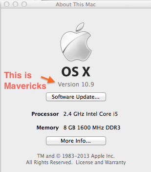

[Week 1 Home](../)

# Computer Set-Up Instructions - Mac

## Learning Competencies
By the end of this lesson, you should be able to:
- Install technologies from the command line
- Clone and run scripts from a repository


## Summary
You will need to have your computer set up with the following tools for Phase 0 of Dev Bootcamp. Make sure to go through this guide step-by-step. You'll need to have each of these technologies installed to have a smooth start to Phase 0 and your future career!

While it's definitely possible to go through Phase 0 using Windows, you'll generally be much happier if you have OS X or at least Linux. This tutorial will cover the setup for a Mac. There will be alternatives for Windows and Linux users.

## Releases
(i.e. directions - each release is necessary for the next release, so be sure to do everything in the order specified for all challenges)

## Release 0: Download Sublime Text 2
Download and follow instructions from [their site](http://www.sublimetext.com).

You don't have to purchase your license right away, you can "cancel" out of the dialog box as many times as you would like, but it is good practice to buy a license after you decide you like it. (Since eventually you're hoping to get paid for writing programs, you want to pay it forward in advance.)

## Release 1: Your Operating System
If you are using OS X, you should upgrade to Mavericks if you haven't already. You can get it from the App Store on your computer and it's free. To find out which operating system you're running, open the "About this Mac," Under OS X, you should see a version. Mavericks is Version 10.9.

**Do NOT download the beta version of Yosemite OSX 10.10, it will cause problems!**



Before installing, it's always good practice to backup your hard drive so you don't lose anything!

## Release 2: Install Command Line Tools
Release 2 - 12 will be run in your terminal. So open it, and type:

```shell
xcode-select --install
```

Follow the prompts to complete the install.

This is apple's C compiler which will enable you to compile native apps from source. (i.e. Ruby)

If you can't find the terminal, simply search "terminal" in spotlight.

## Release 3: Install Homebrew
Also called "Brew." Brew is like the app store for the command line (i.e. your terminal). If you ever need any command-line tool, try installing with Brew before other methods. (ex. ```brew install name-of-thing```)

Install brew by copying and pasting this beautiful code into your terminal:

```shell
ruby -e "$(curl -fsSL https://raw.github.com/Homebrew/homebrew/go/install)"
```
It will prompt you for your password - so be ready to type it in.

## Release 4: Set up your Path
First you need to clone this github repository into your computer and install the files. Type each line separately:

```shell
git clone https://github.com/supertopher/dotfiles.git
cd dotfiles
./install
```
Installing these files will configure your bash profile, enable autocomplete, always display rspec with color, and allow you to use "subl" as a shortcut to open sublime. Note: this will replace your current bash profile. 

## Release 5: Configure Git
You then need to overwrite .gitconfig to your own username and password in GitHub. Use your name and your Github email address in the following format:

```shell
git config --global user.name "John Doe"
git config --global user.email johndoe@example.com
```

Now make sublime text your preferred editor for git:
```shell
git config --global core.editor "subl -w"
```

## Release 6: Set up Sublime
Follow [these instructions](https://github.com/Devbootcamp/phase-0-handbook/blob/master/text-editor-setup.md) in the Phase 0 Handbook to make Sublime your default text editor.

## Release 7: Install Rbenv
Type: ```brew install rbenv```

Now you have Rbenv! Sweet!

**NOTE:** If you already have RVM installed, you will not need to install Rbenv. Do not try to install both, they don't work well together and will mess up your machine. Rbenv is preferred in many of our locations, so if you have RVM and want to install Rbenv, you'll have to uninstall RVM first.

## Release 8: Install Ruby Build
Type: ```brew install ruby-build```

Rbenv uses this to install individual versions of Ruby. (Did you know you can have multiple versions of ruby on your machine?)

**NOTE:** If you are using RVM instead of rbenv, you will not need to install ruby-build.

## Release 9: Install Ruby 2.0.0
Type: ```rbenv install 2.0.0-p481```

Now, you need to set the default ruby in your computer to the ruby we just installed.

Type: ``` rbenv global 2.0.0-p481```

NOTE: You just installed Ruby 2.0.0 as your default. When you are reading the Ruby Docs, make sure you are referring to this version, NOT Ruby 2.1.0.

## Release 10: Install Git
Type: ```brew install git```

This installs git and autocompletion for git.

## Release 11: Install Node
Node allows you to run Javascript in your terminal.

Type: ```brew install node```

You'll use this later in Phase 0.

## Release 12: Install Rspec
Type ```gem install rspec```

This will install RSpec, a ruby testing framework.

## Release 13: Install SQLite
Type ```brew install SQLite3```

To overwride your system copy of SQLite, we need to type an additional command:

```brew link sqlite3 --force```

## Release 14: Install Postgres
Type the following commands one at a time:

NOTE: If you have trouble installing postgres, don't worry about it. You won't need it until Phase 2. We wanted to have it set up in advance when your path was all sqeakly clean and wonderful, but if you have trouble, just move on.

```shell
brew install postgres
mkdir -p $HOME/Library/LaunchAgents
ln -sfv /usr/local/opt/postgresql/*.plist ~/Library/LaunchAgents
launchctl load ~/Library/LaunchAgents/homebrew.mxcl.postgresql.plist
```

You are now ready to start Phase 0!
