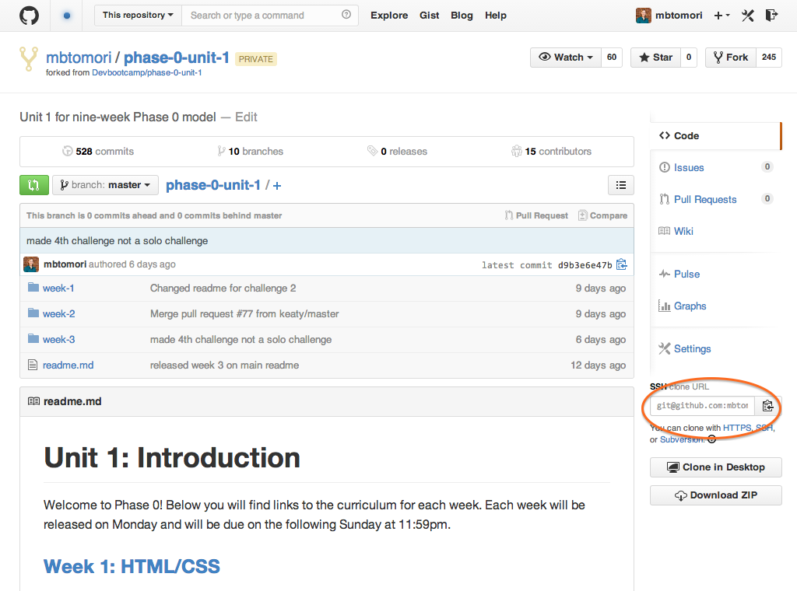

# Forking and Cloning

## Username
I'm sure you've chosen an excellent and memorable username for GitHub, so don't forget it! When you see "[USERNAME]" in this guide, replace it with your username. For example, my username is "mbtomori". So "github.com/**[USERNAME]**" becomes "github.com/**mbtomori**".

## Forking
Click the "Fork" button at the top right of this page.

This will make a copy of the Unit 1 curriculum repository into your personal GitHub account. This will be where you add reflections and your challenge code. After you click fork, you should be taken from the Devbootcamp.com/phase-0-unit-1 repo to [USERNAME]/phase-0-unit-1.

## Repository Settings
### Enable Issues

You will need to enable issues as a feature so other students can leave you feedback.

### Privacy
Your repository will be private by default. That is intentional. But others in Phase 0 will have access to see your code and will be able to give you feedback because you are all on the same team (and have issues enabled). Please do not make your repository public.

## Cloning

A git repository is "distributed", which means it exists on many computers instead of just one.  Right now your repository exists on GitHub, but in order to add or edit files using your text editor, you need it to exist on your computer.

In git terms, this is called **cloning a repository locally**. A "local repository" is the copy on your computer. A "remote repository" is one on another server, i.e. on GitHub, or on another person's computer.

#### Cloning a repository with the command line
Now you'll want to bring the repository to our computer. There is a series of commands to do this.

First, open your terminal and check where you are (type `pwd`). You NEVER want to clone a repository into another local github repository, so **always** make sure you are the correct directory, like your Desktop or a phase-0 folder.

The first step is to get the URL of your FORKED repo (Don't clone Devbootcamp's version of the repo!). This is found here:

Mine says SSH URL. If you have your SSH key set up with Github you can use this. Otherwise click HTTPS and use that URL. Copy this URL to your clipboard.

`git clone URL_THAT_YOU_COPIED `

If you are using HTTPS, you will be prompted to enter your github username and password. (You won't be able to see what you type, when you finish entering your username, press enter. You will then be prompted to enter your password -- press enter when you're finished).

Now you should see some stuff execute, it looks like you're hacking a mainframe from the 90s.

After the command prompt appears again, execute the command `ls`. You should now see the folder with the same name as the repo you cloned! Navigate into this folder with `cd` and open it in Sublime.

Once you have it open in sublime, you can see all of the files and directories. Find the directory this file is in, and open the "README.md" file. From now on, you should read all instructions and complete all challenges in sublime. This will help you read and write markdown as well as better understand the file tree. Take a look at the links to images, for example. Do you know what the `../` does? If not, find out!
