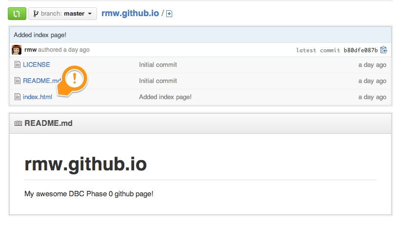

[Week 1 Home](../)

# U1.W1: Basics of the Web

## Learning Competencies

- Describe the following: web server, browser, HTML, CSS, domain, DNS
- Create an HTML file

## Summary

## Releases

## Release 0: Learn

#### Web Concepts
Select two of these resources and use the knowledge you learn to add definitions on the my_reflection file. You only need to add definitions to the topics you learned about.

* Watch [How the Internet works in 5 Minutes](https://www.youtube.com/watch?v=7_LPdttKXPc)
* Read: Web concepts -- [Internet vs. Web](http://skillcrush.com/2012/08/19/the-internet-vs-the-web/), [Web Browser](http://skillcrush.com/2012/10/01/web-browsers/), [Web Server](http://skillcrush.com/2012/07/03/web-server-2/)
* Read: [Web site vs Web App](http://skillcrush.com/2013/03/28/websites-vs-web-applications/)
* Read: Domain concepts -- [What's a domain](http://skillcrush.com/2012/11/01/domain-2/), [DNS](http://skillcrush.com/2012/04/24/dns/), [IP Address](http://skillcrush.com/2012/07/03/ip-address-2/)
* Read: [Introduction to DNS](http://coding.smashingmagazine.com/2011/05/25/introduction-to-dns-explaining-the-dreaded-dns-delay/)
* Read: [What's HTML?](http://skillcrush.com/2012/04/02/html/)


## Release 1: Create a web page
Now let's put that knowledge to work!  We will be using [Sublime Text](http://www.sublimetext.com/) as our [text editor](http://skillcrush.com/2012/09/10/text-editor/). Review the [Perfect Workflow in Sublime Text](http://code.tutsplus.com/articles/perfect-workflow-in-sublime-text-free-course--net-27293) if you need a refresher on how to write code using Sublime.

* **Open a new file in Sublime**
* Save the file as `index.html` in the **same directory as your copy of <USERNAME>.github.io**


* Add the following **HTML code** to your file:

```html
<html>
  <body>
      Hello DBC!
  </body>
</html>

```
* **Save the file**

## Release 2: Commit and Push
Using your github skills, add the file to the stage, commit your changes, and push it to Github.

After your push is done, your remote repo which lives on github.com will be updated.

## Release 3: View your site

It's now time for the big reveal!!

Go to **http://<USERNAME>.github.io** to see your HTML page live!<br>
*NOTE: It can sometimes take up to 15 minutes to update the site after creating your repo, so if you run into a 404 error, be patient and check again later.*


You can also see the new index.html file in your GitHub repository!



#### [AMAZING!](http://www.youtube.com/watch?v=ewfIvKbuRUg)

## Release 4: Web Concepts
Complete Part 1 (web concepts assignment) in the [my_reflection.md](my_reflection.md) file.

## Release 5: Reflection
Reflect on your learning by editing Part 2 of the [my_reflection.md](my_reflection.md) file associated with this challenge.

## Release 6: Push
Then commit and push your changes to your remote repository! Make sure you can see the changes on GitHub!
