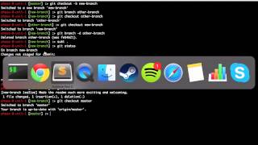
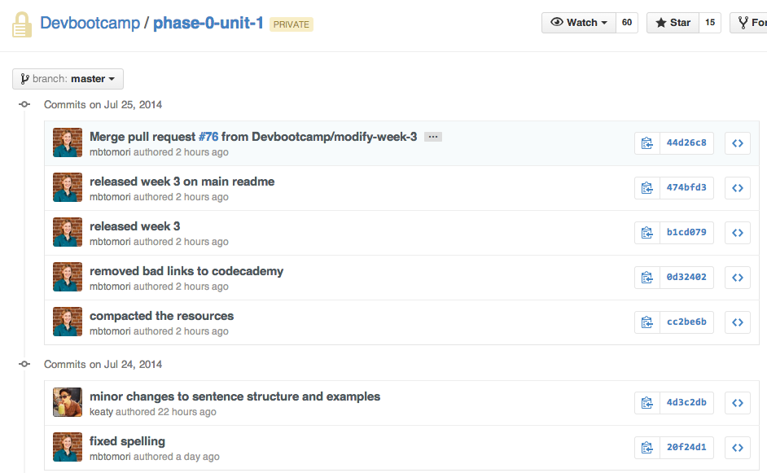

[Week 1 Home](../)

# U1.W1: Introduction to Version Control, git, and GitHub

## Learning Competencies
By the end of this lesson, you should be able to:
- Navigate repositories in GitHub
- Compare git and GitHub
- Explain what version control is and does

## Summary
Web Developers use tools to track their progress and create backups. GitHub is a popular platform for this, especially in the open-source community. In this challenge, we want to introduce you to GitHub so you don't feel lost when working through the material.

## Releases

## Release 0: GitHub Vocabulary

#### Repositories
You know how you make folders on your computers? In each folder, you can have other folders or files. A GitHub repository is essentially the same as a folder on your computer, except that it's on the web. It can have folders, also called directories, and files. If you take a look at [phase-0-unit-1](../../), you'll see three folders (week-1, week-2, and week-3) listed at the top, and a file called "README.md." GitHub displays README files on the main page of a repository by default.

From the main page of a repository, click on the appropriate link to access that week's curriculum. You've already proved you've made it to week-1 by navigating to and reading this challenge.

The README in each directory will be the main source of instructions that will direct you through the curriculum. Make sure to read all the instructions carefully. If you have questions on instructions, post them in the Google+ community.

Challenges will be contained in directories or individual files. You can determine the order of the challenges in two ways:
  1. The README lists the challenges in order.
  2. The challenges are numbered in the order needed to complete them in the section where directories and files are displayed (above the README).

Don't overthink the web version of GitHub too much. It's a very similar structure to a computer's file structure you already know.

#### Branches

Here is a youtube video explaining branching in git: 

By default, all repositories have a `master` branch. This is where the most perfect, well-tested code lives. The master branch should be the most ideal version of your code and always working/running properly.

In cases where people want to make changes or add features, they will make a new branch off of the master (using `git co -b branch-name`). This will take a copy of the code from the master and allow you to make changes and test them out. Once they are fully tested, they can be merged back into the master branch.

When you work on teams, it's always a good idea to have someone else review your code before it's merged into `master`. This is done through a pull request. A pull request is a friendly way of saying: "Hey boss! I'm done implementing this feature your asked for, can you review my code?". When working in a team, it is best practice to have at least 1 other person review your pull request and they should be the person to merge it once the changes are approved.

When using your command line, you can see your local branches (the branches on your local computer) by typing:

`git branch`

If you want to see your local and remote branches, type:

`git branch -a`

Remote branches are also located on GitHub.com.

**Please Note:**

In Phase 0, the staff use branches as described above, but we also use it to capture final versions of curriculum. The `master` branch is where the current copy of the curriculum is stored. So if you are in Unit 1, you should refer to the `master` branch for the most recent copy of your curriculum. Once you finish Unit 1, however, we will create a copy of that curriculum to capture the final version and store that on a branch. We also use feature branches to make larger modifications to the curriculum (as shown in the image below):

#### Commits

A commit is a snapshot of your code that you can go back to at any time. I like to think of it as an official "saving" of your code. When you decide you like the changes you made, or you finish a small task, you should commit the changes. Commits have an accompanying "commit message" that should describe the changes. Check out what the commit log looks like for the devbootcamp curriculum repo!

We will talk more about commits in the [tracking changes](../7-tracking-changes) challenge.

## Release 1: What is git?

GitHub uses git for version control. Go through the following resources to learn a bit about what that means.

- Read: [Version Control](http://skillcrush.com/2013/02/11/version-control/)
- Read: Skillcrush's Git Series [Git](http://skillcrush.com/2013/02/18/git/) and [Getting Started with Git](http://skillcrush.com/2013/02/20/get-started-working-with-git/)
- Watch: [Git 3 Minute Primer](http://www.youtube.com/watch?v=_Jmkvv_nKTE)

## Release 2: Git vs. GitHub

Confused about the difference between git and GitHub? Try one of these articles:

- [Git vs. GitHub for Dummies](http://stephaniehoh.github.io/blog/2013/10/07/git-vs-github-for-dummies/)
- [Is Git the same as GitHub?](http://www.jahya.net/blog/?2013-05-git-vs-github)

## Release 4: Reflect
You know the drill at this point! Consider the following questions, and answer them in your text editor or on paper so you can add them to your next challenge reflection properly using git.

* Write an explanation of and compare git and GitHub to a non-technical audience.
* Describe what version control is and how GitHub helps with it.
* Why do developers use version control (git)? Does that make sense to you? Why or why not?
* What doesn't make sense? What does?
