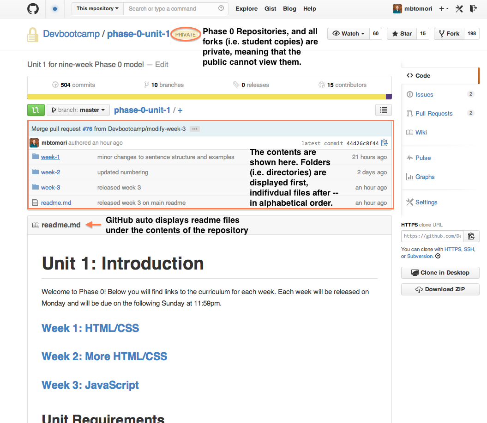

[Back](README.md)

# Git and GitHub

## Learning Competencies
By the end of this lesson, you should be able to:

- Describe GitHub
- Navigate Phase 0 Repositories in GitHub
- Compare git and GitHub
- Explain what version control is and does

## Summary
Web Developers use tools to track their progress and create backups. GitHub is a popular platform for doing this, especially in the open source community. In this introduction, we want to introduce you to GitHub so you don't feel too lost when working through your Phase 0 material. 

## Releases
(i.e. directions - each release is necessary for the next release, so be sure to do everything in the order specified for all challenges)

## Release 0: GitHub Vocabulary

#### Repositories
You know how you make folders on your computers? In each folder, you can have other folders or files. A GitHub repository is essentially the same as a folder on your computer, except that it's on the web. It can have folders and files. If you take a look at [phase-0-unit-1](../../), you'll see three folders (week-1, week-2, and week-3) listed at the top, and a file called "readme.md." Github displays readme files on the main page of a repository by default. 

From the main page of a repository, click on the week curriculum you want to access, in this case, you've already proven you've made it to week-1 by navigating to and reading this challenge. 

The readme in each directory will be the main source of instructions that will direct you through the curriculum. Make sure to read the instructions carefully. 

Challenges will be contained in directories or individual files. You can determine the order of the challenges in two ways:
  1. The readme will give a list of challenges in order
  2. The challenges are numbered in the order needed to complete them 

Don't overthink the web version of github too much. It's a very similar structure to the file structure you already know well. 

#### Branches
Instructions for current curriculum (i.e. the unit you are currently in) is stored on the master branch (i.e. main, working branch) of each Phase 0 repository. When Unit 1 is over, we will make a branch that will be a record of the final state of the unit curriculum. 

#### Commits

Commits are records of changes. It's kind of like saving your work, only you don't just get to click the "save" button to do so. The great thing about git is that you can revert back to any previous commit. So say I'm working on a project and accidentally delete a directory that I didn't mean to, and I commit the change and push it to the master branch. Major oops in programs like Microsoft Word or Excel. But GitHub is great, because I can just go back to the commit before. Because you may have to do this, it's good to save and commit early and often. 

Commits have an accompanying message that explains what the changes were.

## Release 1: What is git?

GitHub uses git for version control. Go through the following resources to learn a bit about verson control and git.

- Read: [Version Control](http://skillcrush.com/2013/02/11/version-control/)
- Read: Skillcrush's Git Series [Git](http://skillcrush.com/2013/02/18/git/) and [Getting Started with Git](http://skillcrush.com/2013/02/20/get-started-working-with-git/)
- Watch: [Git 3 Minute Primer](http://www.youtube.com/watch?v=_Jmkvv_nKTE)

#### Git vs. GitHub

Confused about the difference between git and GitHub? Try one of these articles:

- [Git vs. GitHub for Dummies](http://stephaniehoh.github.io/blog/2013/10/07/git-vs-github-for-dummies/)
- [Is Git the same as GitHub?](http://www.jahya.net/blog/?2013-05-git-vs-github)

### Release 2: Reflection
Reflecting is essential for solidifying your learning. You will be expected to complete a reflection for each challenge in Phase 0. It will help you learn how you learn, give opportunities for sharing resources, and help your instructors gauge your progress. Reflections are for you, but they will also be read by others, so make sure to write for an audience.

**Writing reflections for each challenge is mandatory.**

Before you can complete your reflection, you'll need to click the "Fork" button at the top right of this page. You be completing most of your assignments in your unit-specific repositories. DO NOT move your reflections into your [USERNAME].github.io repository. These are separate repositories.

This will make a copy of the unit 1 curriculum repository into your personal GitHub account. This will be where you add reflections and later solutions. After you click fork, you should be taken from the Devbootcamp.com/phase-0-unit-1 repo to [USERNAME]/phase-0-unit-1

Reflect on your learning by editing the my_reflection.md file in the [1_get_started](./) folder (the folder you are in). You will be learning HTML this week, but these files have a `.md` extension. Do you know what that stands for? It stands for markdown, which is a text-to-HTML conversion tool.  If you would rather write in HTML, you can do that by changing the file extension from .md to .html.

You can complete the first 2 challenge reflections on github.com. Click on the my_reflection.md file in this folder. There should be a button to edit at the top. Click it. You'll add your reflection in markdown and write a commit message under "Commit changes". Once you type something there, you will want to click the "commit changes" button. **NOTE: It will not let you commit changes without a commit message.**

After you learn how to edit files locally and push your changes (in the third challenge), you'll want to edit all files on your local `phase-0-unit-1` repository--more on that later.

