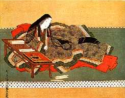
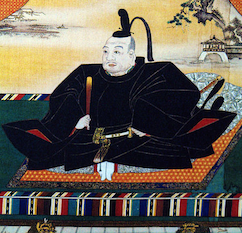

[Week 4 Home](./)

# U1.W3: Homework Cheater!

## Learning Competencies
- Define a method that accepts and uses arguments
- Use conditionals (if/elsif/else)
- Apply string, array, hash, and/or enumerable methods

## Summary
I'm sure you had times in school where you forgot you had a response assignment due and you didn't start it yet. Did you quickly throw something together during lunch? (I sure did).

In this challenge, you will create a program that will output something to turn in to your teacher. Think of this as academic mad lib. It doesn't have to be good (as evidenced by the example below), and it can be as easy or challenging as you design it to be. Have fun and challenge yourself!

For example:

```ruby
def essay_writer(title, topic, date, thesis_statment, pronoun)
  # Your awesome code here!
end

japanese_history_1 = ["The First Novelist", "Shikibu Murasaki", 1000, "She wrote the world's first novel, the Tale of Genji, between 1000 and 1012 and was a lady-in-waiting in the Heian Imperial court.", female]

japanese_history_2 = ["The First Shogun", "Tokugawa Ieyasu", 1603, "His most important contribution to history is that he founded the Tokugawa period, a peaceful time that lasted over 200 years.", male]

essay_writer(japanese_history_1) #=> this will output the text below, which I've saved as a variable `my_award_winning_essay_1` and "award_winning_essay_2"

award_winning_essay_1 = "The First Novelist"

"Shikibu Murasaki was an important person in 1000." She did a lot. I want to learn more about her. She wrote the world's first novel, the Tale of Genji, between 1000 and 1012 and was a lady-in-waiting in the Heian Imperial court. Shikibu's contribution is important

award_winning_essay_2 = "The First Shogun"

"Ieyasu Tokugawa was an important person in 1603. He did a lot. I want to learn more about him. His most important contribution to history is that he founded the Tokugawa period, a peaceful time that lasted over 200 years. Tokugawa's contribution is important."
```

## Release 0: Create a Template
You will want to use a single template to do at least three different responses on three different subjects.

## Release 1: Define your output
First, write a generic template (store in a variable) that accounts for the following:
     1. Title
     2. Person/place/topic
     3. Important date or fact
     4. Thesis statement

Identify three topics you want to use and write out your ideal paragraph using your generic template. Store these in variables so you can compare your code's output.

For example:

```ruby
puts essay_writer(japanese_history) == my_award_winning_essay
#=> should output `true` if your code works
```
This is a simple piece of driver test code. Driver test code is the most basic test you can write. It simply uses a comparison to evaluate whether the output is what you expected.

## Release 2: Write [Pseudocode](https://github.com/Devbootcamp/phase-0-handbook/blob/master/coding-references/pseudocode.md)
Identify the steps you need, the inputs and outputs, etc.

## Release 3: Write your [Initial Solution](https://github.com/Devbootcamp/phase-0-handbook/blob/master/coding-references/initial-solution.md)

## Release 4: Then try [refactoring](https://github.com/Devbootcamp/phase-0-handbook/blob/master/coding-references/refactoring.md) your solution.
See the link for more information about refactoring.

## Release 5: Refactor for difficulty (Optional)
- Use the appropriate pronoun for a person (male or female), place, or thing (HINT: this may be a good place to try creating an object...)
- Modify singular and plural nouns based on basic rules. (ie. you probably don't want to bother with something as crazy as "fish")
- Refer to a person by the last name after the first use of their name

## Release 5: Use the [reflection guidelines](https://github.com/Devbootcamp/phase-0-handbook/blob/master/coding-references/reflection-guidelines.md) to write your reflection.

## Release 6: Publish
Commit and push your solution to GitHub.

## Great Job!
Shikibu Murasaki and Tokugawa Ieyasu congratulate you on your fine essay!


